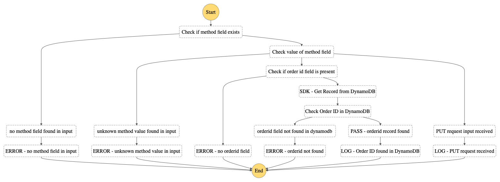

cdk-api-stepfunction
====================

A demo CDK stack to retrieve a record using two methods from DynamoDB. The Express Step Function has a parallel step where one branch retrieves the record using the Step Functions SDK integration. The second branch retrieves the record using a NodeJS Lambda function. You can use this stack to compare and benchmark the latency behind each method.

