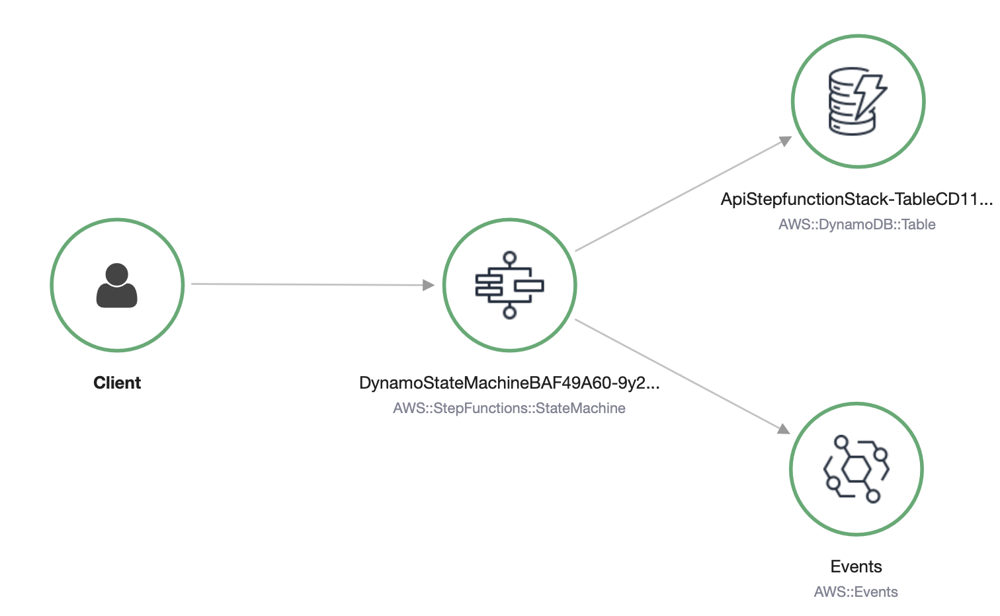

cdk-api-stepfunction
====================

A demo CDK stack to retrieve a record from DynamoDB using Express Step Function. The State Machine contains no Lambda functions but can validate the inputs and format the output records that are retrieved. All events are logged to EventBridge for "human friendly" logging of the process. 

# State Machine

# X-Ray trace

# FAQ

Is this an overcomplicated design? Possibly. 
Could it be simplified? Definitely. 
